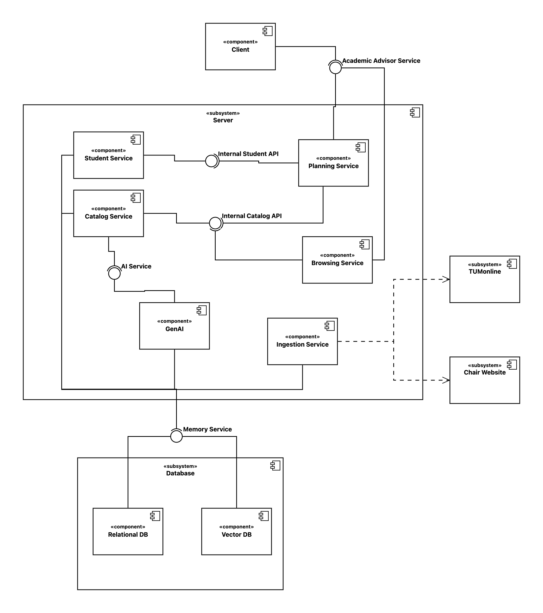

# team-http-418

## AI-Driven Academic Navigator (AIDAN)

### Problem Statement

TUM students need clear, personalized guidance to navigate complex course catalogs and align their academic choices with their long-term career goals. Existing traditional advising and course selection methods are overwhelming, lack continuous support, and often focus purely on fulfilling credit quotas rather than building the specific skill sets required for a student's desired industry or future projects.

There is a critical need for an intelligent application that analyzes a student’s academic history and future aspirations to recommend the most efficient course selection. While TUM provides comprehensive course descriptions, these are currently buried within a student's specific study degree, causing students to miss out on valuable interdisciplinary options. Furthermore, existing university systems are highly fragmented, often, a central system lacks essential course information entirely, forcing students to hunt down details across individual chair websites. The app will overcome these limitations by seamlessly integrating the entire university catalog into a single, centralized platform, enabling users to search for relevant courses on any topic while intelligently mapping out prerequisite dependencies and credit requirements.

The app should provide smart mapping and personalized recommendations based on career interests and individual user preferences, such as scheduling constraints, workload limits, or preferred learning formats. Acting as a bridge between academia and the professional world, this centralized system allows students to make faster, more informed decisions, preventing wasted tuition, delayed graduation, and registration errors. By offering a clear, interactive roadmap, the system optimizes credit fulfillment, bridges the skills gap, and empowers students to confidently take control of their academic journey.

### User Stories

Describe some scenarios how your app will function?

**1. Academic Tracking:** As a student, I want to upload or sync my completed course transcript, so that the system can automatically track my fulfilled credits and identify my remaining degree requirements.
**2. Profile & Recommendations:** As a student, I want to receive personalized course recommendations based on my completed modules, career goals, and interests, so that I can choose electives that strategically align with my future plans.
**3. Centralized Search:** As a student, I want to search and filter the entire TUM catalog in one centralized platform that merges main university data with individual chair websites, so that I can easily find interdisciplinary options without navigating fragmented systems.
**4. Prerequisite Mapping:** As a student, I want to clearly see course prerequisite dependencies and receive proactive alerts for unmet requirements, so that I understand what I need to complete beforehand and avoid registration errors.
**5. Scheduling Preferences:** As a student, I want to set personal scheduling constraints (e.g., maximum ECTS per semester, no morning classes), so that the app generates schedule options tailored to my availability and manageable workload capacity.
**6. Conflict Resolution:** As a student, I want to receive immediate warnings about scheduling conflicts or excessive credit workloads when building my plan, so that I can avoid stressful or unrealistic semester combinations.
**7. Pathway Visualization:** As a student, I want to view my recommended course pathway as a clear, interactive semester-by-semester roadmap, so that I can confidently track my progress toward graduation.

### Product Backlog

| ID | Name | Priority | Rationale |
| :--- | :--- | :--- | :--- |
| **AIDAN 1** | Academic Tracking | `Critical` | Foundational feature. The system cannot make accurate recommendations or map prerequisites without first knowing the user's completed credits. |
| **AIDAN 2** | Centralized Search | `Critical` | Core functionality. Without integrating the university catalog and chair data, the app has no database to pull courses from. |
| **AIDAN 3** | Profile | `Major` | Captures the student's long-term career goals and academic interests. This data input is required to tailor the app to the individual rather than providing generic suggestions. |
| **AIDAN 4** | Recommendations | `Major` | The core value proposition of the app. It synthesizes data from Academic Tracking (AIDAN 1), Centralized Search (AIDAN 2), and the Profile (AIDAN 3) to generate intelligent, personalized course suggestions. |
| **AIDAN 5** | Pathway Visualization | `Major` | The primary UI/UX output for the user to consume the app's core value (the interactive semester-by-semester roadmap). |
| **AIDAN 6** | Prerequisite Mapping | `Minor` | Essential for ensuring the recommendations are actually usable and prevent registration errors. |
| **AIDAN 7** | Scheduling Preferences | `Minor` | Highly useful for personalization, but the app can still deliver its core academic pathway without time-of-day constraints initially. |
| **AIDAN 8** | Conflict Resolution | `Minor` | A great quality-of-life feature to warn about schedule overlaps, but secondary to actually generating the core pathway. |

---

### Initial System Structure

The application follows a modern, decoupled client-server architecture with a dedicated microservice for AI processing. This separation of concerns ensures scalability, maintainability, and optimal performance across different technological domains. The system is divided into the following four core components:

#### Client: React (Vite + TanStack Router) Frontend
The user interface is built as a Single Page Application (SPA) using React, providing a highly responsive and dynamic experience for students navigating complex course maps.
*   **Vite** is utilized as the build tool to guarantee lightning-fast server starts and Hot Module Replacement (HMR) during development, as well as highly optimized static assets for production.
*   **TanStack Router** is implemented for robust, type-safe routing. This is critical for managing the application's complex nested views (e.g., navigating between interactive semester roadmaps, centralized search, and user profile settings) while maintaining a reliable UI state.

#### Server: Spring Boot REST API
The core business logic, user management, and data orchestration are handled by a Spring Boot backend.
*   This server acts as the primary API gateway for the React client, exposing secure, well-documented RESTful endpoints.
*   It handles traditional backend responsibilities such as authentication, data validation, and CRUD operations. Furthermore, it acts as an orchestrator, securely routing complex analytical requests to the GenAI microservice and aggregating the results before sending them back to the client.

#### GenAI Service: Python & LangChain Microservice
To isolate heavy computational tasks and leverage the best ecosystem for artificial intelligence, all AI-driven features (such as smart course recommendations and prerequisite mapping) are offloaded to a dedicated Python microservice.
*   **LangChain** is used to orchestrate interactions with the underlying Large Language Models (LLMs), allowing the system to intelligently parse unstructured course data from chair websites and match it against student career goals.
*   By decoupling this from the Spring Boot server, the main backend remains highly performant and avoids being bottlenecked by AI processing latency. Communication between the Spring Boot server and this microservice is handled via internal REST or gRPC calls.

#### Database: PostgreSQL
Data persistence is managed using PostgreSQL, a highly reliable and scalable relational database system.
*   A relational database is the ideal choice for this application due to the highly structured and interconnected nature of university data. PostgreSQL ensures ACID compliance and referential integrity, which is essential when mapping complex prerequisite chains, user credentials, and ECTS credit balances.
*   It serves as the single source of truth, securely accessed and updated exclusively by the Spring Boot server.

# 📚 Project Diagrams

## 🏗️ Subsystem Decomposition Diagramm

## ⚙️ Use Case Diagram

## 🧩 Analysis Object Model (Domain Model)
